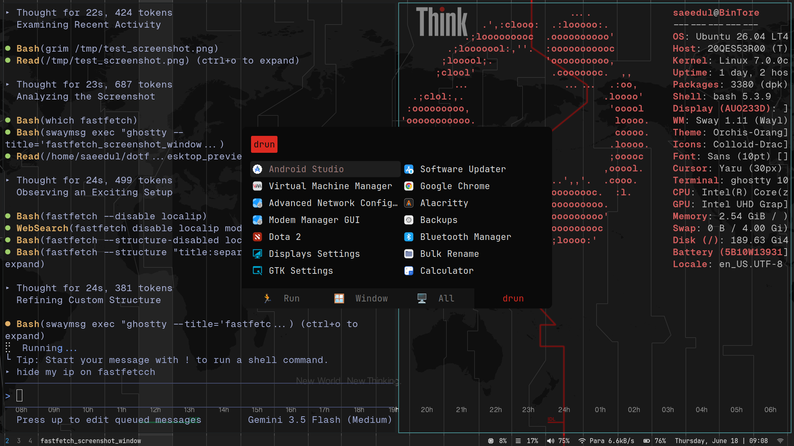

# 🌌 Saeedul's Sway Desktop Environment (Minimal Version)

<div align="center">


*A clean, secure, highly responsive, and gorgeous Gruvbox-themed Sway Window Manager setup for Ubuntu/Debian-based distributions.*

</div>

---

## 📸 Showcase Preview

<div align="center">
  
</div>

---

## ⚙️ Specifications & Tech Stack

| Component | Software / Asset | Details |
| :--- | :--- | :--- |
| **Window Manager** | [Sway](https://swaywm.org/) | Wayland-native tiling window manager (i3-compatible) |
| **Status Bar** | [Waybar](https://github.com/Alexays/Waybar) | Sleek, customizable panel with battery, audio, and network modules |
| **Terminal** | [Ghostty](https://ghostty.org/) & [Alacritty](https://alacritty.org/) | GPU-accelerated console emulators with GitHub Dark & Gruvbox themes |
| **Launcher** | [Rofi-Wayland](https://github.com/lbonn/rofi-wayland) | Application launcher matching active wallpaper colors dynamically |
| **OSD Overlays** | [SwayOSD](https://github.com/ErikReider/SwayOSD) | Modern brightness and volume indicators |
| **GTK Theme** | [Orchis-Theme](https://github.com/vinceliuice/Orchis-theme) | Beautiful rounded flat theme (Dark Orange / Grey variants) |
| **Icon Pack** | [Colloid-Icons](https://github.com/vinceliuice/Colloid-icon-theme) | Sleek, minimal Dracula-inspired system icons |
| **Typography** | [JetBrainsMono Nerd Font](https://www.nerdfonts.com/) | Pixel-perfect monospace fonts for coding and status icons |

---

## 🌟 Key Features

*   **⚡ Automated Installer**: Restore your entire environment on a fresh OS in a single step.
*   **🎨 Dynamic Wallpaper Theming**: Rofi menus auto-quantize colors matching your current wallpaper.
*   **⌨️ Advanced TrackPoint Scroll**: Custom background python mapper translates Caps Lock controls to seamless TrackPoint vertical/horizontal scrolls.
*   **🌘 Adaptive Night Light**: Built-in script controls screen warmth (`sunset.sh`) based on time.
*   **📋 Clipboard History**: Lightweight cliphist integration bound to launcher keys.
*   **🔋 Laptop Optimization**: Automatic display profiles via Kanshi, custom lid handlers, and wake-up triggers for mobile broadband.

---

## 🚀 One-Command Installation

To replicate this clean desktop environment on a fresh installation of Ubuntu 26.04 or any clean Debian-based distribution, open your terminal and run:

```bash
git clone <your-minimal-dotfiles-repo-url> ~/minimal-dotfiles && cd ~/minimal-dotfiles && chmod +x install.sh && ./install.sh
```

---

## ⌨️ Common Keyboard Shortcuts

| Shortcut | Action |
| :--- | :--- |
| `Mod1 + Enter` | Open default terminal (Ghostty) |
| `Mod1 + Shift + Enter` | Open LibreWolf web browser |
| `Mod1 + Space` | Open Application Launcher (Rofi) |
| `Mod1 + Shift + Space` | Open System Run Dialog |
| `Mod1 + Shift + P` | Open Clipboard Selector |
| `Mod1 + Q` | Kill focused window |
| `Mod1 + Arrow Keys / HJKL` | Move focus |
| `Mod1 + Shift + Arrow / HJKL`| Move container |
| `Mod1 + Shift + C` | Reload Sway configuration |
| `Mod1 + Backspace` | Lock system screen |
| `Mod1 + Shift + E` | Open system log-out menu (nwg-bar) |
| `PrintScreen` | Capture full screen |
| `Mod1 + PrintScreen` | Select and copy area screenshot to clipboard |

---

## 💾 Backing Up Changes

If you customize your configurations locally (e.g. keybindings, status bar modules, custom colors), you can update your repository by running:

```bash
cd ~/minimal-dotfiles
./backup.sh
```
This automatically syncs your active `~/.config` files back to this folder, ready to be committed and pushed to GitHub.
